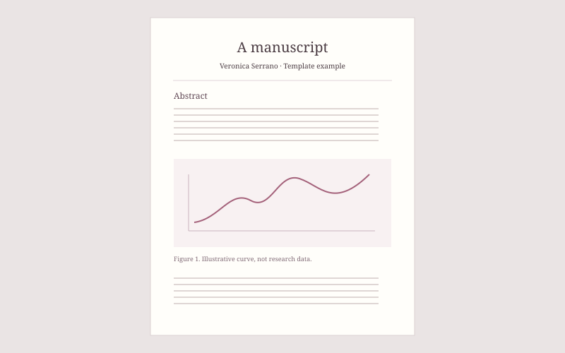

## Abstract

This is an example manuscript page, with no real research results. Replace this text with an abstract or a short summary of your paper.

*Figure 1. An illustrative manuscript layout.*

## Details

You can write a full article here, or keep the page short and link to the manuscript PDF. The text stays selectable and readable on phones, and images keep their original proportions.

| Material | Description |
| :--- | :--- |
| Manuscript | Add your paper PDF to this folder |
| Figures | Add images beside this Markdown file |
| Supporting material | Link to any additional files |

<!-- Place manuscript.pdf next to this file, then uncomment:
[Read the manuscript](./manuscript.pdf)
-->
