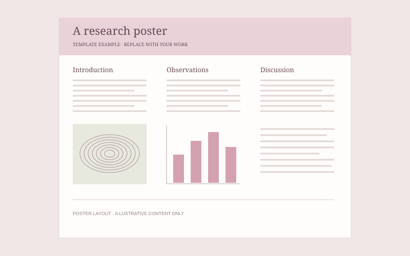

*Figure 1. A poster layout example. The diagrams are illustrative.*

## Overview

Add a short explanation of your research question, where you presented this poster, and what you learned.

<!-- Place poster.pdf in this folder, then uncomment this link:
[View the poster PDF](./poster.pdf)
-->
