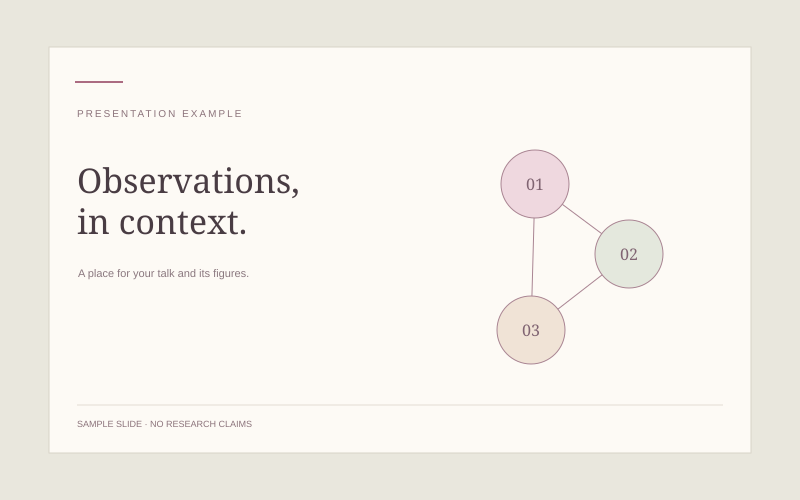

*Figure 1. A presentation example, ready to replace with your own slides.*

## Presentation

Write a short introduction to the talk. Add slide images below, or link to a PDF of the complete presentation.

<!-- Place slides.pdf next to this file, then uncomment:
[View the slides](./slides.pdf)
-->
